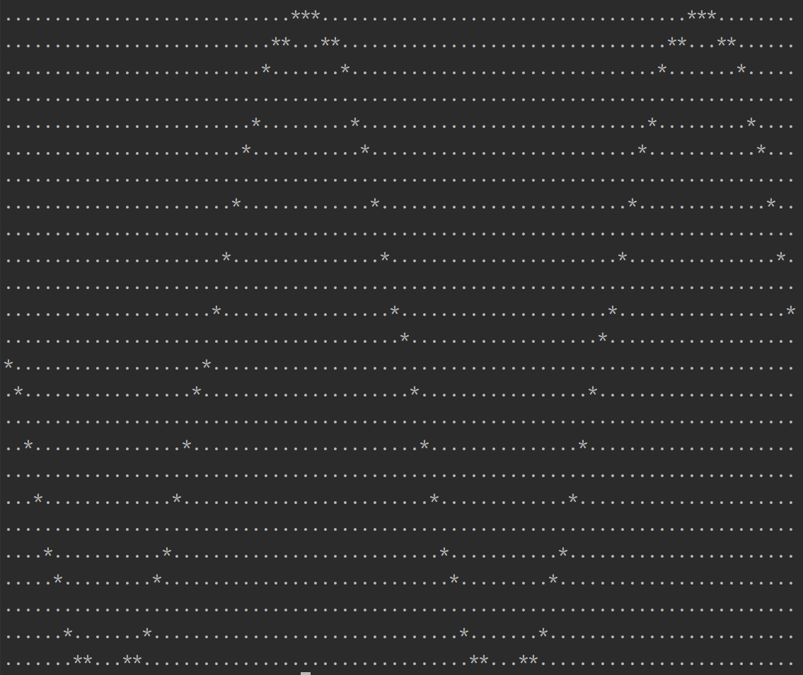
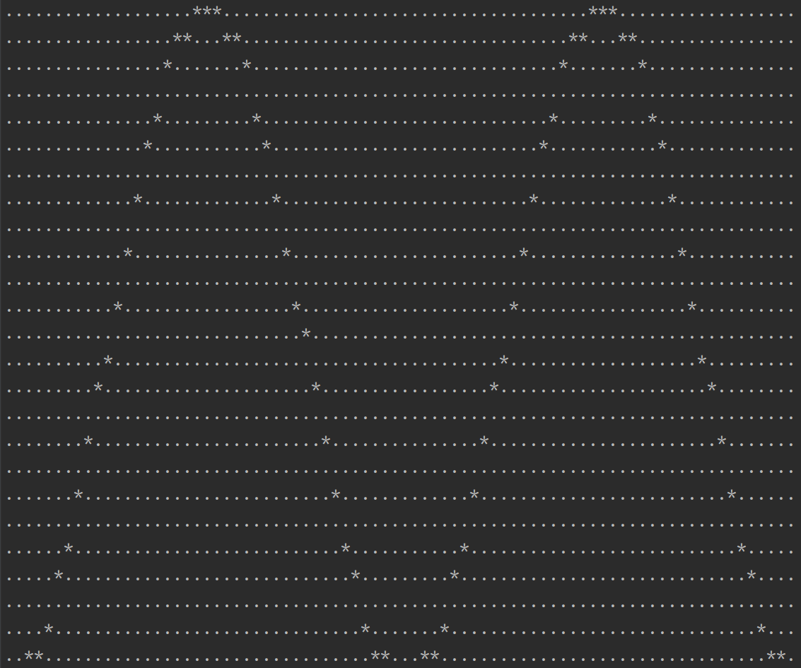

<a id="readme-top"></a>


<!-- PROJECT LOGO -->
<br />
<div align="center">
  <a href="https://github.com/chugunova24/terminal-draw-graph">
    
  </a>

<h3 align="center">
Program in C for creating graphs of functions in terminal defined by arbitrary expressions
</h3>
</div>


<!-- TABLE OF CONTENTS -->
<details>
  <summary>Table of Contents</summary>
  <ol>
    <li>
      <a href="#about-the-project">About The Project</a>
    </li>
    <li>
      <a href="#getting-started">Getting Started</a>
      <ul>
        <li><a href="#installation">Installation</a></li>
        <li><a href="#usage">Usage</a></li>
      </ul>
    </li>
    <li><a href="#contact">Contact</a></li>
</ol>
</details>


<!-- ABOUT THE PROJECT -->
## About The Project

<div align="center">
  <a href="https://github.com/chugunova24/terminal-draw-graph">
    
  </a>
  <p style="font-style: italic;">Рис.1 Graph of function sin(x)</p>
</div>
<br>
The program create a graph of function in the terminal based on a mathematical expression entered by the user.
The expression parser is based on Dijkstra's algorithm for translating an expression (infix notation) into Polish notation (postfix notation).
The graph is displayed, reflected horizontally, in the terminal.

<br>
<p>The following conditions are used:</p>
<li>The size of the field for displaying graphs is a rectangle of 25 by 80 points.</li>
<li>Definition area - [0; 4 Pi]</li>
<li>Range of values - [-1; 1]</li>
<li>Orientation of the coordinate plane - the ordinate axis is directed downward, the abscissa axis is directed to the right.</li>
<li>The center of coordinates is middle of the left border (point {0, 12}). </li>
<li>Values are rounded according to the rules of mathematics</li>


<p align="right">(<a href="#readme-top">back to top</a>)</p>


<!-- GETTING STARTED -->
## Getting Started

### Installation

1. Clone the repository:
   ```sh
   git clone https://github.com/chugunova24/terminal-draw-graph.git
   ```

2. Go to the project folder. Create a build/ folder:
   ```sh
   cd terminal-draw-graph
   mkdir build
   ```

3. Go to the build folder. Build the project using cmake:
   ```sh
   cd build
   cmake ../
   make
   ```

<p align="right">(<a href="#readme-top">back to top</a>)</p>


<!-- USAGE EXAMPLES -->
### Usage

#### Example 1.
Enter the following command in the terminal:
   ```sh
   ./build/graph "cos(x)"
   ```
As a result, the sin(x) graph will be displayed in the terminal:
<div align="center">
  <a href="https://github.com/chugunova24/terminal-draw-graph">
    
  </a>
  <p style="font-style: italic;">Рис.2 Graph of function cos(x)</p>
</div>

<p align="right">(<a href="#readme-top">back to top</a>)</p>


<!-- CONTACT -->
## Contact

Tatiana C. - [@chugunova24](https://github.com/chugunova24) - t.chugunova24@gmail.com

Project Link: [https://github.com/chugunova24/terminal-draw-graph.git](https://github.com/chugunova24/terminal-draw-graph.git)

<p align="right">(<a href="#readme-top">back to top</a>)</p>
