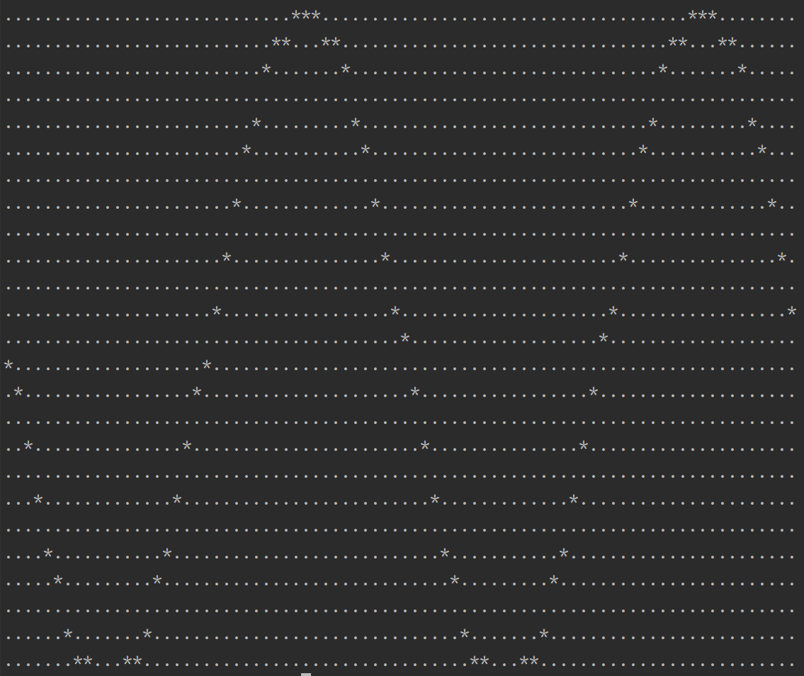

<a id="readme-top"></a>


<!-- PROJECT LOGO -->
<br />
<div align="center">
  <a href="https://github.com/chugunova24/terminal-draw-graph">
    
  </a>

<h3 align="center">
Программа для построения графиков функций в терминале
</h3>
</div>


<!-- TABLE OF CONTENTS -->
<details>
  <summary>Оглавление</summary>
  <ol>
    <li>
      <a href="#about-the-project">О проекте</a>
    </li>
    <li>
      <a href="#getting-started">Как начать</a>
      <ul>
        <li><a href="#installation">Установка</a></li>
        <li><a href="#usage">Использование</a></li>
      </ul>
    </li>
    <li><a href="#contact">Контакты</a></li>
</ol>
</details>


<!-- ABOUT THE PROJECT -->
## О проекте

<div align="center">
  <a href="https://github.com/chugunova24/terminal-draw-graph">
    
  </a>
</div>

Программа строит график функции в терминале на основе введенного пользователем
математического выражения.
Парсер выражения основан на алгоритме Дейкстры для перевода выражения в польскую нотацию (постфиксная нотация).
График выводится в терминал (область значений [1;-1]).

<p align="right">(<a href="#readme-top">вернуться к началу</a>)</p>


<!-- GETTING STARTED -->
## Как начать

### Установка

1. Склонируйте репозиторий:
   ```sh
   git clone https://github.com/chugunova24/terminal-draw-graph.git
   ```

2. Зайдите в папку с проектом. Создайте папку build:
   ```sh
   cd terminal-draw-graph
   mkdir build
   ```
   
3. Зайдите в папку build. Выполните сборку проекта с помощью cmake:
   ```sh
   cd build
   cmake ../
   make
   ```

<p align="right">(<a href="#readme-top">вернуться к началу</a>)</p>


<!-- USAGE EXAMPLES -->
### Использование

#### Пример 1.
Введите в терминале следующую команду:
   ```sh
   ./build/graph "sin(x)"
   ```
В результате работы программы в терминал выведется график sin(x):
<div align="center">
  <a href="https://github.com/chugunova24/terminal-draw-graph">
    
  </a>
  <p style="font-style: italic;">Рис.1 График функции sin(x)</p>
</div>

<p align="right">(<a href="#readme-top">вернуться к началу</a>)</p>


<!-- CONTACT -->
## Контакты

Татьяна Ч. - [@chugunova24](https://github.com/chugunova24) - t.chugunova24@gmail.com

Ссылка на проект: [https://github.com/chugunova24/terminal-draw-graph.git](https://github.com/chugunova24/terminal-draw-graph.git)

<p align="right">(<a href="#readme-top">вернуться к началу</a>)</p>
